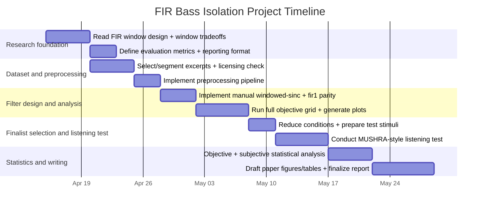

# Design and Implementation of a Windowed Low-Pass FIR Filter for Bass-Frequency Isolation in Music Audio

## Executive summary

This report establishes a rigorous research basis and a reproducible experimental plan for designing and evaluating **low-pass FIR filters** (designed by the **windowing method**) to isolate **low-frequency content**—typically bassline fundamentals and kick energy—from full-mix music audio. The core engineering tension is that, at common audio sampling rates (44.1 kHz, 48 kHz), cutoffs like **150–250 Hz** correspond to **very small normalized cutoffs**, so short FIR filters (e.g., **N ≤ 200**) generally yield **wide transition bands** and **limited isolation** compared with an ideal “brick-wall” low-pass. This is not a failure of MATLAB; it is a predictable consequence of the window method’s smoothing behavior, where transition width is governed by the window transform mainlobe and becomes especially problematic when the low-pass bandwidth is “very small” relative to Nyquist. citeturn4view1turn16search17turn3view1

The recommended experimental approach is therefore to treat **N = 50, 100, 200** as a *didactic baseline* and include at least one **longer filter** condition (e.g., **N = 1000 and/or 2000**) to demonstrate meaningful separation and to quantify the latency/compute tradeoffs. Linear-phase FIR filters are expected to have approximately constant group delay of **N/2 samples**, which must be accounted for in waveform comparisons and listening tests. citeturn4view2turn1search0

The plan evaluates a factorial grid:

- Sampling rates: **44.1 kHz**, **48 kHz** (also optionally unify all audio to one rate via resampling for comparability). citeturn18search3turn18search1turn19search2  
- Cutoffs: **150, 200, 250 Hz** (with explicit normalized cutoff calculations for `fir1`). citeturn3view1turn3view2  
- Orders: **N = 50, 100, 200** (baseline) plus **N = 500, 1000, 2000** (recommended to reveal isolation/latency trends). citeturn4view2turn1search0  
- Windows: **Rectangular, Hann, Hamming, Blackman** (with expected sidelobe/attenuation tradeoffs grounded in canonical window comparison data). citeturn10view1  

Evaluation combines:
- Objective filter metrics derived from `freqz` and `grpdelay` (passband ripple, stopband attenuation, transition width, group delay) citeturn0search1turn4view2  
- Signal-level audio outcomes: energy retained below cutoff (PSD integration via Welch), before/after FFT/PSD and spectrogram analyses citeturn11search2turn4view3  
- A standardized subjective protocol built on **ITU-R BS.1534 (MUSHRA)** for intermediate impairments and **ITU-R BS.1116** principles for rigorous experimental design and statistical treatment. citeturn20view2turn20view1  

Assumptions (explicit):
- Offline processing (not hard real-time), stereo-to-mono optional, and availability of MATLAB with Signal Processing Toolbox functions (e.g., `fir1`, `freqz`, `spectrogram`, `pwelch`). citeturn3view1turn4view3turn11search2  
- “Bassline isolation” is interpreted as **low-frequency component isolation**, not true source separation (limitations section quantifies why). citeturn4view1turn5view0  

## Theoretical foundation and design equations

An ideal discrete-time low-pass filter has a rectangular frequency response: unity gain below a cutoff and zero above. The inverse Fourier transform yields an **infinite-duration impulse response**, i.e., the “brick-wall” low-pass is not implementable as a finite FIR without approximation. citeturn5view0turn3view2

### Ideal low-pass impulse response

Let the ideal low-pass cutoff be \( \Omega_c \) (rad/sample). The ideal impulse response \(h_D[n]\) is (for \(n \neq 0\)) proportional to \( \sin(\Omega_c n)/(\pi n) \), and for \(n=0\) equal to \( \Omega_c/\pi \). This derivation is explicitly shown in standard FIR-by-windowing lecture notes and course materials (via inverse DTFT over \([-\Omega_c,\Omega_c]\)). citeturn5view0turn4view0

A common audio-parameterized form uses cutoff in Hz:
- \( f_c \) (Hz), \( f_s \) (Hz), normalized frequency \( f_c/f_s \) cycles/sample  
- \( \Omega_c = 2\pi \frac{f_c}{f_s} \)

Then a MATLAB-friendly ideal low-pass kernel (centered at 0) is:
\[
h_D[n] = 2\frac{f_c}{f_s}\,\text{sinc}\!\left(2\frac{f_c}{f_s}n\right)
\]
where MATLAB’s `sinc(x)` uses \(\sin(\pi x)/(\pi x)\). This is equivalent to the sinusoidal form above. citeturn5view0turn3view2

### Windowing and practical FIR coefficients

The window method constructs a finite filter by multiplying the infinite impulse response by a finite window:
\[
h[n] = w[n]\cdot h_D[n-n_0], \quad n=0,\ldots,N
\]
where \(N\) is the FIR order (length \(L=N+1\)), and \(n_0=N/2\) centers the kernel so the resulting FIR is causal and (for symmetric \(w[n]\)) linear phase. Retaining the “central section” of the ideal impulse response is a standard route to a linear-phase FIR approximation. citeturn3view2turn4view1turn5view0

Critically, time-domain multiplication by a window corresponds to **frequency-domain convolution** of the ideal response with the window transform, which creates:
- a **finite transition band** (no brick wall),
- **stopband ripple/leakage** linked to the window sidelobes,
- **passband ripple** near discontinuities (Gibbs phenomenon). citeturn4view1turn5view0

In fact, truncation-induced ripples and overshoots near discontinuities are a classic Gibbs phenomenon; increasing the length localizes the oscillations but does not remove them entirely, and window choice controls ripple height. citeturn5view0

### Linear phase and group delay

For a symmetric FIR filter (typical under windowed-sinc design), the phase response is approximately linear in frequency, implying a near-constant **group delay**. MATLAB documentation emphasizes that for a linear-phase FIR, group delay is **one-half the filter order** (\(N/2\) samples), which must be considered when comparing input/output waveforms. citeturn4view2turn1search0

## Design space with concrete parameter calculations

This section specifies the exact design grid requested and provides concrete normalized cutoff values and expected window tradeoffs.

### Sampling rates to consider

Two sampling rates are prioritized because they occur frequently across music and production pipelines and are explicitly supported in professional audio interface standards:
- **44.1 kHz** (common in consumer/music distribution families),
- **48 kHz** (common in broadcast/production contexts; broadcast wave specifications note 48 kHz as normal for broadcast use). citeturn18search1turn18search3

For controlled experiments, it is often preferable to **unify all audio to a single target sampling rate** (e.g., 48 kHz) via polyphase resampling, to make filters comparable across files. MATLAB’s `resample` uses a polyphase anti-aliasing filter for rate conversion. citeturn19search2turn19search0

### Candidate cutoff frequencies and normalized cutoff calculations

For MATLAB `fir1`, the cutoff `Wn` is specified on \((0,1)\), where **1 corresponds to the Nyquist frequency**; `fir1` defines the cutoff as the **–6 dB point**. citeturn3view1turn3view2

The conversion is:
\[
W_n=\frac{f_c}{f_s/2}=\frac{2f_c}{f_s}
\]
This yields the following values (rounded):

| \(f_s\) | \(f_c\) | \(W_n = f_c/(f_s/2)\) |
|---:|---:|---:|
| 44,100 | 150 | 0.006803 |
| 44,100 | 200 | 0.009070 |
| 44,100 | 250 | 0.011338 |
| 48,000 | 150 | 0.006250 |
| 48,000 | 200 | 0.008333 |
| 48,000 | 250 | 0.010417 |

Interpretation: these \(W_n\) are extremely small, which is why short FIRs tend to have broad transition regions at these low cutoffs; the window-method transition bandwidth is governed by the window transform mainlobe, and for very narrow lowpass bandwidths the overall response increasingly resembles the window spectrum rather than a sharp brick-wall response. citeturn4view1turn16search17

### Filter orders/lengths to test with latency and computational cost

Requested orders (baseline): **N = 50, 100, 200**.  
Recommended extensions (to reveal meaningful separation trends): **N = 500, 1000, 2000**.

For linear-phase FIR, approximate group delay is \(N/2\) samples. citeturn4view2turn1search0

Concrete delays:

| \(f_s\) | \(N\) | Length \(L=N+1\) | Group delay (samples) | Group delay (ms) |
|---:|---:|---:|---:|---:|
| 44,100 | 50 | 51 | 25 | 0.567 |
| 44,100 | 100 | 101 | 50 | 1.134 |
| 44,100 | 200 | 201 | 100 | 2.268 |
| 44,100 | 1000 | 1001 | 500 | 11.338 |
| 44,100 | 2000 | 2001 | 1000 | 22.676 |
| 48,000 | 50 | 51 | 25 | 0.521 |
| 48,000 | 100 | 101 | 50 | 1.042 |
| 48,000 | 200 | 201 | 100 | 2.083 |
| 48,000 | 1000 | 1001 | 500 | 10.417 |
| 48,000 | 2000 | 2001 | 1000 | 20.833 |

Compute cost for direct-form time-domain FIR filtering is approximately \(L\) multiply-accumulate operations per output sample per channel. The practical implication is that very long FIRs increase both latency (group delay) and arithmetic cost, motivating the explicit cost/latency reporting required in the paper. citeturn21view0turn4view2

### Window types to compare and expected tradeoffs

The required windows are: **rectangular, Hamming, Hann, Blackman**.

Canonical window comparisons report that lowering sidelobes (better leakage/stopband attenuation) generally increases effective mainlobe width (wider transition). The classical tabulation in Harris’s window survey gives representative “highest sidelobe level” values (for windows used in DFT contexts), which are useful as expected leakage indicators. citeturn10view1turn9view2

From Harris Table I (selected rows): citeturn10view1

| Window | Highest sidelobe level (dB) | Practical expectation for FIR LPF stopband |
|---|---:|---|
| Rectangular | –13 | Very poor stopband rejection; strong leakage |
| Hann (Hanning) | –32 | Moderate rejection; wider transition than rectangular |
| Hamming | –43 | Better rejection than Hann; common compromise |
| Blackman | –58 | Strong rejection; usually widest transition among these four |

These expectations align with the window-method explanation that stopband behavior arises from integrating/convolving sidelobes of the window transform, and transition width tracks the mainlobe bandwidth of the window transform. citeturn4view1turn16search17

## MATLAB implementation details and reproducible procedure

This section specifies exactly how to implement both (a) a **manual windowed-sinc FIR**, and (b) a **`fir1`-based design**, and how to apply the filter and generate the required plots/outputs.

### `fir1` versus manual coefficient generation

**`fir1`**:  
- Designs standard band FIR filters and accepts a window vector of length \(N+1\); default window is Hamming. citeturn3view1turn3view2  
- `fir1` uses a least-squares approximation and then smooths the impulse response with a window (MATLAB’s own description), so it is “windowed” but not always identical to a pure analytic windowed-sinc derivation. citeturn3view2  
- `fir1`’s cutoff corresponds to the –6 dB point, which must be recognized when comparing against an ideal brick-wall low-pass at \(f_c\). citeturn3view1turn3view2  

**Manual windowed-sinc** (recommended for methodological transparency in a paper):  
1) define ideal low-pass kernel analytically (sinc form),  
2) choose a window \(w[n]\),  
3) multiply and then normalize (e.g., DC gain = 1).  
This directly implements the window method described in standard FIR design materials. citeturn5view0turn4view1turn3view2

In the paper, you can implement both and show they are close (they often will be, within definition differences like –6 dB cutoff and scaling). citeturn3view1turn3view2

### `conv` versus `filter`

For FIR filtering:
- Linear convolution of input \(x\) with FIR coefficients \(h\) is the mathematical foundation; MATLAB notes this explicitly and shows `conv` as a direct implementation for finite-length signals, returning an output whose length is one less than the sum of input lengths. citeturn21view0  
- `filter(b,1,x)` returns an output the **same length as the input** and is the standard streaming form (with optional initial conditions). citeturn21view1turn21view0  

For offline audio processing where you want a same-length result, you can use:
- `y = filter(b,1,x)` (simple, streaming-consistent), or
- `y = conv(x,b,'same')` (same-length linear convolution variant), then compensate group delay explicitly if needed.

### `freqz`, `grpdelay`, FFT/PSD, and spectrogram

- `freqz` is the standard MATLAB routine to compute frequency response of digital filters. citeturn0search1  
- Group delay can be computed directly and MATLAB explicitly documents the relationship for linear-phase FIR (roughly \(N/2\)). citeturn4view2turn1search7  
- `spectrogram(x,window,noverlap,nfft,fs)` returns STFT values with frequency in Hz when `fs` is supplied; parameters `window`, `noverlap`, and `nfft` are explicit. citeturn4view3turn0search2  
- `pwelch` provides Welch PSD estimates and is appropriate for objective band-energy metrics. citeturn11search2  

### Reproducible experimental procedure with exact MATLAB pseudocode and parameter values

The following procedure is designed to be copy-paste runnable with minimal modifications (file paths, list of audio excerpts). It produces all required plots, metrics tables, and audio exports.

**Global experiment settings (fixed):**
- Target sampling rate for comparability: `targetFs = 48000;` (also run `44100` condition if required) citeturn18search3turn19search2  
- Excerpt duration: `clipDur = 20;` seconds (within requested 10–30 s)  
- Cutoffs: `[150 200 250]` Hz  
- Orders: baseline `[50 100 200]`, extended `[500 1000 2000]`  
- Windows: `rectwin`, `hann`, `hamming`, `blackman` (symmetric windows for FIR) citeturn15search3turn16search0turn15search1turn15search2  
- Spectrogram parameters (chosen to resolve low frequencies reasonably):
  - `stftWinLen = 4096;`
  - `stftWindow = hann(stftWinLen,"periodic");`
  - `stftOverlap = 3072;` (75%)
  - `stftNfft = 16384;`  
  These settings leverage MATLAB’s explicit parameterization of `spectrogram`; using `"periodic"` window sampling is consistent with DFT periodic extension assumptions as documented for MATLAB windows. citeturn4view3turn15search1turn15search2turn16search0  

**Step-by-step MATLAB pseudocode (with exact values):**
```matlab
%% Experiment configuration
fsList      = [44100 48000];          % evaluate both
cutoffsHz   = [150 200 250];
ordersN     = [50 100 200 500 1000 2000];   % includes required and extended
winNames    = ["rectwin","hann","hamming","blackman"];

% Frequency-response evaluation grid
nFreqz = 2^17;   % high-resolution freq response grid
% Spectrogram parameters (resolve LF band)
stftWinLen  = 4096;
stftWindow  = hann(stftWinLen,"periodic");
stftOverlap = 3072;
stftNfft    = 16384;
% PSD parameters for band-energy integration
psdWinLen   = 8192;
psdWindow   = hamming(psdWinLen,"periodic");
psdOverlap  = 6144;
psdNfft     = 32768;

% Evaluation band definitions (explicit, consistent)
% Define passband edge and stopband edge relative to fc for metrics:
passFrac = 0.8;   % f_p = 0.8*fc
stopFrac = 2.0;   % f_s = 2.0*fc

%% Dataset list (to be filled with your excerpts)
audioFiles = [
  "EDM_clip01.wav"
  "EDM_clip02.wav"
  "AltRock_clip01.wav"
  "AltRock_clip02.wav"
  % ... add more
];

results = table();

%% Main loop
for fileIdx = 1:numel(audioFiles)

    % --- Load audio and select a 20 s excerpt ---
    [x,FsIn] = audioread(audioFiles(fileIdx));
    % stereo -> mono mix (optional)
    if size(x,2) == 2
        x = mean(x,2);
    end
    % DC removal and normalization
    x = x - mean(x);
    x = x ./ max(abs(x) + eps);

    % Clip to fixed duration
    nSamp = min(length(x), round(20*FsIn));
    x = x(1:nSamp);

    for fsTarget = fsList

        % Resample for controlled comparison
        if FsIn ~= fsTarget
            x_rs = resample(x, fsTarget, FsIn);
        else
            x_rs = x;
        end
        Fs = fsTarget;

        % Precompute baseline spectral summaries for x_rs
        [Pxx,fPxx] = pwelch(x_rs, psdWindow, psdOverlap, psdNfft, Fs);
        % (Optional) baseline spectrogram
        % spectrogram(x_rs, stftWindow, stftOverlap, stftNfft, Fs, "yaxis");

        for fc = cutoffsHz

            Wn = fc/(Fs/2);  % normalized cutoff for fir1

            for N = ordersN

                L = N + 1;

                for wName = winNames

                    % --- Window vector for FIR design ---
                    switch wName
                        case "rectwin"
                            w = rectwin(L);
                        case "hann"
                            w = hann(L);      % symmetric
                        case "hamming"
                            w = hamming(L);
                        case "blackman"
                            w = blackman(L);
                    end

                    % --- Manual windowed-sinc LPF (transparent window method) ---
                    n = 0:N;
                    m = n - N/2;
                    hd = 2*fc/Fs * sinc(2*fc/Fs * m);   % ideal LPF, centered
                    b_manual = (hd(:) .* w(:));
                    b_manual = b_manual / sum(b_manual); % unity DC gain

                    % --- fir1 design with same window ---
                    b_fir1 = fir1(N, Wn, w, "scale");

                    % --- Choose which to use for filtering (recommend manual for paper) ---
                    b = b_manual;

                    % --- Frequency response and group delay ---
                    [H,fH] = freqz(b,1,nFreqz,Fs);     % fH in Hz
                    magdB = 20*log10(abs(H) + 1e-12);

                    gd = grpdelay(b,1,nFreqz,Fs);      % group delay (samples)

                    % --- Objective filter metrics (defined bands) ---
                    fp = passFrac*fc;
                    fsb = stopFrac*fc;

                    passIdx = (fH >= 0) & (fH <= fp);
                    stopIdx = (fH >= fsb) & (fH <= Fs/2);

                    passRipple_dB = max(magdB(passIdx)) - min(magdB(passIdx));
                    stopAtten_dB  = -max(magdB(stopIdx));   % positive dB attenuation
                    meanGD_samp   = mean(gd(passIdx));

                    % Compute "transition width" based on -1 dB and -40 dB crossings (example)
                    % (Adjust thresholds as needed)
                    f_m1 = interp1(magdB, fH, -1, "linear", "extrap");
                    f_m40 = interp1(magdB, fH, -40, "linear", "extrap");
                    transWidth_Hz = max(0, f_m40 - f_m1);

                    % --- Filter audio ---
                    y = filter(b,1,x_rs);

                    % Delay-compensate for waveform comparisons (integer approx)
                    d = round(N/2);
                    y_aligned = [y(d+1:end); zeros(d,1)];

                    % --- Energy retained below cutoff (Welch PSD integration) ---
                    [Pyy,fPyy] = pwelch(y_aligned, psdWindow, psdOverlap, psdNfft, Fs);

                    bandIdx = (fPxx >= 0) & (fPxx <= fc);
                    Ein  = trapz(fPxx(bandIdx), Pxx(bandIdx));
                    Eout = trapz(fPyy(bandIdx), Pyy(bandIdx));
                    energyRetained = Eout / (Ein + eps);

                    % --- Brick-wall comparison on same grid (ideal magnitude) ---
                    Hideal = double(fH <= fc);
                    magLin = abs(H);
                    mseMag = mean((magLin - Hideal).^2);

                    % --- Save metrics row ---
                    newRow = table(audioFiles(fileIdx), Fs, fc, N, wName, ...
                        passRipple_dB, stopAtten_dB, meanGD_samp, transWidth_Hz, ...
                        energyRetained, mseMag, ...
                        'VariableNames', ["file","Fs","fc","N","window", ...
                        "passRipple_dB","stopAtten_dB","meanGD_samp","transWidth_Hz", ...
                        "energyRetained","mseMag"]);

                    results = [results; newRow];

                    % --- Optional: export audio for selected conditions only ---
                    % audiowrite("out_" + fileIdx + "_" + Fs + "_" + fc + "_" + N + "_" + wName + ".wav", y_aligned, Fs);

                end
            end
        end
    end
end

% Summarize results
writetable(results,"fir_bass_isolation_results.csv");
```

Why these exact functions and calls are appropriate:
- Audio I/O: `audioread` returns samples and the file’s sample rate; `audiowrite` exports the processed audio with chosen `Fs`. citeturn19search0turn19search1  
- Resampling: `resample` performs polyphase anti-aliasing resampling, allowing controlled cross-file comparisons. citeturn19search2  
- FIR design: `fir1` expects normalized `Wn` in (0,1) and accepts explicit window vectors (default Hamming); cutoff is –6 dB. citeturn3view1turn3view2  
- Analysis: `freqz` and `spectrogram` provide frequency response and STFT in MATLAB’s canonical workflow. citeturn0search1turn4view3  
- PSD integration: `pwelch` provides stable PSD estimates for band-energy metrics. citeturn11search2  

## Objective metrics, subjective protocol, and statistical analysis plan

### Objective metrics to report

The report should define metrics in a way that is consistent across all designs and interpretable in audio terms:

**Filter-response metrics (from `freqz`):**
1) **Passband ripple (dB)**: peak-to-peak magnitude variation over a defined passband (e.g., \(0 \le f \le 0.8 f_c\)).  
2) **Stopband attenuation (dB)**: negative of the maximum stopband magnitude (e.g., \(f \ge 2 f_c\)).  
3) **Transition width (Hz)**: either the designer-defined \(f_s - f_p\) or a measured width based on magnitude thresholds (e.g., –1 dB to –40 dB crossings).  
4) **Group delay (samples/ms)**: mean group delay in the passband; for linear-phase FIR expect ≈ \(N/2\). citeturn4view2turn1search7  

**Signal-level audio metrics (before/after filtering):**
5) **Energy retained below cutoff**: integrate PSD from 0–\(f_c\) (Welch) for input vs output and report ratio. `pwelch` is designed for PSD estimation and supports overlapped segment averaging. citeturn11search2  
6) **Leakage above cutoff**: integrate PSD over representative midband (e.g., 500–2000 Hz) to quantify how much non-bass remains. This is especially relevant because musical mixes often contain strong midrange percussive/instrument energy that you want suppressed.  
7) **Ideal brick-wall approximation error**: compute mean squared error (MSE) between \(|H(f)|\) and an ideal step \(H_{\text{ideal}}(f)\). This is conceptually consistent with standard L2 error criteria described in FIR windowing lecture materials. citeturn4view0turn5view0  

**Comparison-to-ideal plots:**
- Overlay **ideal brick wall** and actual \(|H(f)|\) for 0–2 kHz.  
- Plot error curve \(|H(f)| - H_{\text{ideal}}(f)\) versus frequency.  
The theoretical premise that a sharp discontinuity yields an infinite impulse and truncation causes oscillatory artifacts is central to interpreting these plots. citeturn5view0turn4view1  

### Spectrogram and FFT parameter choices

Because music is strongly nonstationary, the paper should use **spectrograms**, not only a single full-clip FFT. MATLAB’s `spectrogram` explicitly supports control over segment window, overlap, and FFT length, returning frequency in Hz when `fs` is specified. citeturn4view3turn0search2  

Recommended “paper-ready” figures (exact settings used above):
- STFT window length 4096, Hann periodic, 75% overlap, NFFT 16384  
- Plot frequency range 0–2000 Hz and emphasize 0–500 Hz for bass energy tracking.

To explain parameter choice, cite MATLAB’s spectrogram description of how windowing and overlap define segments and how `nfft` sets FFT points. citeturn4view3  

### Subjective evaluation protocol with standard grounding

Because the output can sound “bass-isolated” yet unpleasant (excessive dullness, ringing, phase-delay artifacts if mis-handled), subjective evaluation should follow standardized listening-test logic.

Two relevant ITU recommendations:
- **ITU-R BS.1534 (MUSHRA)**: intended for **intermediate quality** systems and emphasizes controlled experimental design and scoring expectations. citeturn20view2  
- **ITU-R BS.1116**: emphasizes careful experimental design, randomization, and statistical analysis for small impairments; its structure and rigor principles are useful guidance even if you choose MUSHRA-style scoring. citeturn20view1  

**Concrete listening-test design (MUSHRA-style, adapted to bass isolation):**
- Participants: aim for **n = 12–24** listeners (within-subject); report whether “expert” or “naïve.” ITU documents emphasize controlling confounds via design and randomization. citeturn20view1turn20view2  
- Stimuli: for each excerpt, present:
  - Hidden reference: the reference signal (original) or a “reference bass” target (see below)
  - Conditions: filtered outputs for selected designs (do not overload the panel with every condition; see reduction strategy below)
  - Anchor: a deliberately degraded low-pass (e.g., very low cutoff 80 Hz with moderate N) to anchor the “bad” end (MUSHRA concept). citeturn20view2  
- Task and scales (0–100 MUSHRA-like continuous scale):
  - “Bass isolation quality” (how well does it isolate bass region?)
  - “Naturalness / musical usefulness”
  - “Artifacts” (ringing, pumping, muffling)
- Randomization: randomize condition order per trial and excerpt; ITU emphasizes that fixed order can confound judgments. citeturn20view1turn20view2  

**Reference choice (important):**
- If you use the *original full mix* as “reference,” listeners may penalize low-pass conditions because they sound dull by definition.  
- A stronger approach is to frame the listening test around **“quality of low-frequency component extraction”** by using:
  - Reference = a “best available” extraction (e.g., very long Blackman/Hamming N=2000 at fc=250) as hidden reference, and
  - Anchor = overly muffled extraction (fc=80).  
This aligns the subjective task with the actual goal (low-frequency isolation), consistent with a MUSHRA multi-stimulus comparison where a high-quality reference exists. citeturn20view2turn20view0  

### Statistical analysis plan for objective and listening data

**Objective metrics (freq response + PSD-derived)**
- Experimental design: factorial within-clip design with factors:
  - \(f_s \in \{44.1,48\}\) kHz  
  - \(f_c \in \{150,200,250\}\) Hz  
  - \(N \in \{50,100,200,500,1000,2000\}\)  
  - window \(\in \{\)rectangular, Hann, Hamming, Blackman\(\}\)
- Treat “audio excerpt” as a repeated-measures unit.
- Preferred model: linear mixed-effects model (LME), e.g.:
  - fixed effects = window, order, cutoff, sample rate, interactions
  - random intercept = excerpt (and optionally random slope for order if enough excerpts)
- Report: estimated marginal means, 95% confidence intervals, and effect sizes (e.g., standardized differences) for main comparisons.

**Listening-test ratings**
- Because each listener rates multiple conditions, use repeated-measures statistics:
  - If treating scores as approximately interval: repeated-measures ANOVA or LME with random intercept for listener and excerpt.
  - If treating scores as ordinal or non-normal: Friedman test (within-subject) followed by post-hoc Wilcoxon signed-rank with Holm correction.
- Reliability checks:
  - Inter-rater reliability summaries (e.g., Cronbach’s alpha across listeners within excerpt).
  - Screen for inattentive participants by checking hidden-reference scoring (MUSHRA practice). citeturn20view2turn20view1  

## Recommended designs, expected tradeoffs, figures, audio deliverables, and limitations

### Design reduction strategy and final recommended conditions

The full factorial grid is large. For the paper, you can:

1) **Run the full grid objectively** (automated metrics + plots; no listening).  
2) Select a smaller “finalist set” for listening tests:
   - Choose **one cutoff** per excerpt genre based on spectral analysis (often fc=200 or 250), plus one alternate fc for robustness.
   - Choose **three orders**: N=200 (baseline), N=1000, N=2000 (or N=500 if limiting).
   - Choose **three windows**: Hamming, Hann, Blackman (keep rectangular as a “bad baseline” for didactic contrast). citeturn10view1  

### Recommended final designs with justification

Based on canonical window sidelobe behavior and the need for stronger rejection at extremely low normalized cutoffs, the following are strong “paper-ready” final candidates:

**Recommended Design A (balanced):**
- \(f_s = 48\) kHz  
- \(f_c = 200\) Hz  
- \(N = 1000\) or \(2000\)  
- Window: **Hamming**  
Justification: Hamming provides substantially lower sidelobes than Hann and far lower than rectangular, improving rejection of midrange leakage; it is widely used as a compromise window. citeturn10view1turn3view1  
Tradeoff: group delay ~10–21 ms at 48 kHz for N=1000–2000 (audible latency if used live). citeturn4view2turn1search0  

**Recommended Design B (isolation-first):**
- \(f_s = 48\) kHz  
- \(f_c = 200\) Hz  
- \(N = 1000\) or \(2000\)  
- Window: **Blackman**  
Justification: Blackman has much lower sidelobes than Hamming/Hann, so leakage from higher-frequency instruments is more strongly suppressed (expected). citeturn10view1turn15search2  
Tradeoff: wider mainlobe → wider transition → more loss of upper bass harmonics (potential “muddier” or less-defined bass). This follows the general window-method tradeoff described by window-transform convolution and mainlobe/transition behavior. citeturn4view1turn16search17  

**Baseline Design C (course-level / short FIR):**
- \(N = 200\), \(f_c = 200\) Hz, **Hamming** or **Hann**  
Justification: meets the “small order” requirement and demonstrates the method, but expect moderate isolation limits at full sample rate because the window method struggles when bandwidth is extremely small relative to Nyquist. citeturn4view1turn16search17turn3view1  

### Tables to include in the paper

**Table of normalized cutoffs** (already provided) with explicit `fir1` mapping. citeturn3view1turn3view2  

**Window tradeoff table (expected)** grounded in canonical sidelobe tabulation. citeturn10view1  

**Latency/compute table** showing N, taps, group delay, and an estimated multiply-accumulate count per second (mono/stereo). MATLAB’s framing of FIR filtering as convolution supports explaining why longer filters are more expensive. citeturn21view0turn4view2  

### Suggested figures and audio deliverables for the paper

A rigorous paper should include at least:

1) **Impulse response plots** \(h[n]\) (time domain) for each finalist design (N and window). citeturn3view2turn4view1  
2) **Magnitude response** \(|H(f)|\) in dB (0–2 kHz zoom, plus 0–500 Hz zoom). Compute via `freqz`. citeturn0search1  
3) **Phase and group delay** plots to demonstrate linear-phase and quantify delay. citeturn4view2turn1search7  
4) **Ideal brick-wall overlay** vs measured response with quantitative error (MSEMag, integrated error). The theoretical basis for inevitable deviation (infinite impulse vs truncation and Gibbs oscillations) must be explicitly discussed. citeturn5view0turn4view0  
5) **Spectrograms** before and after filtering (0–2 kHz, plus 0–500 Hz) using fixed parameters for comparability. citeturn4view3  
6) **PSD/FFT plots** (Welch PSD recommended) and band-energy bar charts for energy retained below cutoff. citeturn11search2  
7) **Audio clips** (exported WAV):
   - original excerpt (10–30 s)
   - filtered excerpt (delay-aligned)
   - optionally residual high-frequency component \(x - y_{\text{LP}}\) to illustrate what was removed (useful in presentations)

Audio export uses `audiowrite`, which explicitly takes `(filename, y, Fs)` for sample rate. citeturn19search1turn19search8  

### Dataset selection criteria and preprocessing

**Dataset criteria (explicit):**
- Genres: EDM and Alternative Rock (as required; choose tracks with clear bass/kick content and dense mixes).
- Excerpts: **10–30 seconds**, fixed-length per track for comparability; use consistent loudness normalization.
- Mono/stereo: preserve stereo for final audio deliverables, but consider **mono-mix** for analysis simplicity; if you mix to mono, document it and justify (bass isolation typically focuses on low band that is often centered in mixes; but do not assume). Use the same approach across all files.
- Licensing: if the paper will include distributed audio clips, use content you are permitted to redistribute (Creative Commons / self-produced / licensed stems). (This is a practical publication constraint rather than a DSP constraint.)

**Preprocessing (exact steps):**
1) Read audio and sample rate (`audioread`). citeturn19search0  
2) Select a fixed excerpt length (e.g., first 20 s or a chosen segment with bass activity).  
3) Optional mono mix: `mean(x,2)` if stereo (document).  
4) DC removal: subtract mean.  
5) Normalize peak to –1..1 (or normalize RMS; just be consistent).  
6) Resample to target rate (optional but recommended for controlled comparisons): `resample(x,targetFs,FsIn)`. citeturn19search2  

### Limitations and interpretation boundaries

This project is an FIR filtering experiment, not a source-separation system.

Key limitations that should be stated in the paper:

- **No perfect bassline separation:** a low-pass filter preserves *all* low-frequency content, including kick, low toms, rumble, and low-frequency reverb; it cannot disentangle sources that overlap in frequency. This follows directly from the fact that the window method shapes spectra via convolution and does not incorporate any signal model for separating instruments. citeturn4view1turn5view0  
- **Harmonic loss:** bass instruments often have harmonics above 250 Hz; lower cutoffs can preserve the fundamental but reduce perceived definition. This is an expected perceptual consequence of removing upper spectral components (to be demonstrated via listening tests). citeturn20view2turn4view3  
- **Wide transitions at low normalized cutoffs:** at full sample rates, short FIR orders can yield broad transitions, limiting isolation. Theoretical explanations point out that when lowpass bandwidth is very small, the resulting response approaches the window transform and transition behavior is dominated by the window mainlobe. citeturn4view1turn16search17  
- **Latency:** linear-phase FIR introduces delay ≈ \(N/2\). In live use, 20+ ms (N≈2000 at 48 kHz) may be noticeable. citeturn4view2turn1search0  

## Experimental workflow and timeline

### Experimental workflow diagram

```mermaid
flowchart TD
  A[Select audio excerpts<br/>EDM + Alternative Rock] --> B[Preprocess<br/>mono mix optional<br/>DC removal<br/>normalize<br/>resample to fs]
  B --> C[Baseline analysis<br/>PSD (pwelch)<br/>Spectrogram (STFT)]
  C --> D[Design FIR LPFs<br/>fc ∈ {150,200,250} Hz<br/>N ∈ {50,100,200,500,1000,2000}<br/>windows: rect, hann, hamming, blackman]
  D --> E[Verify filter properties<br/>freqz magnitude+phase<br/>grpdelay]
  E --> F[Apply filtering<br/>filter() or conv()<br/>delay alignment]
  F --> G[Objective evaluation<br/>ripple, attenuation, transition<br/>energy retained below fc<br/>brick-wall error]
  G --> H[Select finalists<br/>reduce condition set]
  H --> I[Listening test<br/>ITU-R BS.1534 (MUSHRA-style)<br/>randomization + anchors]
  I --> J[Statistical analysis<br/>mixed-effects / RM-ANOVA<br/>post-hoc corrections]
  J --> K[Paper deliverables<br/>figures + tables + audio clips]
```

This workflow maps directly to MATLAB’s documented analysis/design functions (`fir1`, windows, `freqz`, `spectrogram`, `pwelch`, `filter`) and ITU-based subjective methodology. citeturn3view1turn4view3turn11search2turn20view2turn20view1  

### Timeline diagram



## Key references to cite in the paper

The following sources are strong, primary/official anchors for your bibliography and in-text justification:

- entity["people","Fred J. Harris","window functions survey 1978"], “On the Use of Windows for Harmonic Analysis with the Discrete Fourier Transform” (classic window tradeoff reference; provides sidelobe and bandwidth comparisons). citeturn10view1turn3view0  
- entity["organization","MIT OpenCourseWare","cambridge, ma, us"] lecture notes on FIR filter design by windowing (explicitly frames FIR design as approximating an ideal response with a finite sequence and highlights linear-phase constraints). citeturn4view0  
- entity["organization","MathWorks","natick, ma, us"] official documentation: `fir1`, window functions, `freqz`, `grpdelay`, `spectrogram`, `pwelch`, `audioread`, `audiowrite`, `resample`. citeturn3view1turn4view3turn11search2turn19search0turn19search1turn19search2turn14view0  
- entity["organization","International Telecommunication Union","geneva, switzerland"]: ITU-R BS.1534 (MUSHRA) and ITU-R BS.1116 (rigorous subjective experimental design and statistical reporting). citeturn20view2turn20view1  
- entity["organization","European Broadcasting Union","geneva, switzerland"] technical documentation noting broadcast sampling-rate norms (context for 48 kHz usage). citeturn18search3  
- entity["organization","University of Newcastle upon Tyne","newcastle, uk"] course chapter on FIR filter design by truncation/windowing, deriving ideal LPF impulse response and discussing Gibbs phenomenon and linear-phase concepts. citeturn5view0  
- `dsprelated.com` Spectral Audio Signal Processing text (Julius O. Smith et al.) sections explaining window-method convolution interpretation and why small lowpass bandwidths can yield window-dominated behavior (useful to justify why short FIRs struggle at 150–250 Hz cutoffs at 48 kHz). citeturn4view1turn16search17turn13search12